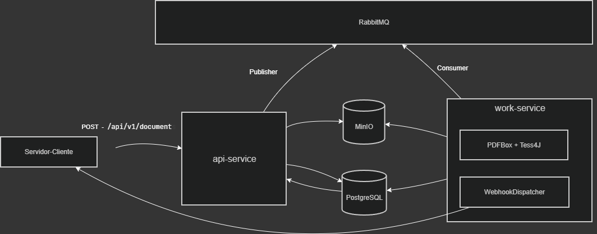

# PDF Processor

Sistema assíncrono de processamento de PDFs com OCR para validação de documentos.

## Arquitetura



## Serviços

| Serviço            | Responsabilidade                                | Porta        |
| ------------------ | ----------------------------------------------- | ------------ |
| pdf-api-service    | Recebe PDFs, registra webhooks, expõe status    | 8080         |
| pdf-worker-service | Processa PDFs via OCR, dispara webhook assinado | 8081         |
| PostgreSQL         | Persistência dos jobs e registros de webhook    | 5432         |
| RabbitMQ           | Fila de processamento + Dead Letter Queue       | 5672 / 15672 |
| MinIO              | Object storage dos PDFs (compatível S3)         | 9000 / 9001  |

## Pré-requisitos

- Java 21
- Maven
- Docker e Docker Compose
- Tesseract OCR instalado localmente

### Instalação do Tesseract (Windows)

1. Baixe o instalador em `github.com/UB-Mannheim/tesseract/wiki`
2. Durante a instalação selecione o pacote de idioma desejado
3. Atualize o `application.yml` do worker com o caminho da pasta `tessdata`:

```yaml
tesseract:
  data-path: C:\Program Files\Tesseract-OCR\tessdata
  language: por
```

## Como rodar

### Desenvolvimento

**1. Suba a infraestrutura:**

```bash
docker-compose up -d postgres rabbitmq minio
```

**2. Suba a API:**

```bash
cd pdf-api-service
./mvnw spring-boot:run
```

**3. Suba o Worker:**

```bash
cd pdf-worker-service
./mvnw spring-boot:run
```

### Produção (Docker completo)

```bash
# Gere os JARs
cd pdf-api-service && ./mvnw clean package -DskipTests
cd ../pdf-worker-service && ./mvnw clean package -DskipTests

# Suba tudo
cd ..
docker-compose up --build
```

## Fluxo de uso

### 1. Registre um webhook

```http
POST /api/webhooks/register
Content-Type: application/json

{
  "ownerId": "seu-sistema",
  "url": "https://seu-backend.com/callbacks/pdf"
}
```

Response:

```json
{
  "webhookId": "uuid",
  "ownerId": "seu-sistema",
  "url": "https://seu-backend.com/callbacks/pdf",
  "secret": "base64-secret",
  "message": "Webhook registrado. Guarde o secret — ele não será exibido novamente."
}
```

> Guarde o `secret` — ele é usado para verificar a autenticidade dos webhooks recebidos.

### 2. Envie um documento

```http
POST /api/v1/documents
Content-Type: multipart/form-data

file:                    <arquivo.pdf>
expectedName:            João Silva
webhookRegistrationId:   <webhookId do passo anterior>
```

Response:

```json
{
  "jobId": "uuid",
  "status": "PENDING",
  "message": "Documento recebido. Você será notificado via webhook quando o processamento terminar."
}
```

### 3. Receba o webhook

Quando o processamento terminar, seu backend receberá:

```http
POST https://seu-backend.com/callbacks/pdf
webhook-id:        uuid-unico-por-disparo
webhook-timestamp: epoch-em-segundos
webhook-signature: v1,base64-hmac-sha256

{
  "jobId": "uuid",
  "status": "DONE",
  "nameFound": true,
  "processedAt": "2026-03-18T14:44:44"
}
```

### 5. Consulte o status (fallback)

Caso o webhook falhe, consulte diretamente:

```http
GET /api/jobs/{jobId}
```

## Swagger UI

Disponível em `http://localhost:8080/swagger-ui.html`

## Status dos jobs

| Status         | Descrição                                  |
| -------------- | ------------------------------------------ |
| PENDING        | Aguardando processamento                   |
| PROCESSING     | Em processamento pelo Worker               |
| DONE           | Processado — nome encontrado               |
| NOT_FOUND      | Processado — nome não encontrado           |
| FAILED         | Erro no processamento                      |
| WEBHOOK_FAILED | Processado mas falha na entrega do webhook |

## Tecnologias

- Java 21
- Spring Boot 3.2
- Spring AMQP (RabbitMQ)
- Spring Data JPA (PostgreSQL)
- Spring Retry
- Flyway
- MinIO SDK
- Apache PDFBox 3
- Tess4J (Tesseract OCR)
- SpringDoc OpenAPI (Swagger)
- Docker
